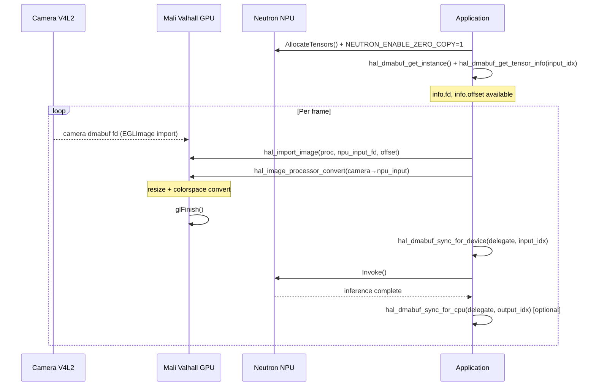
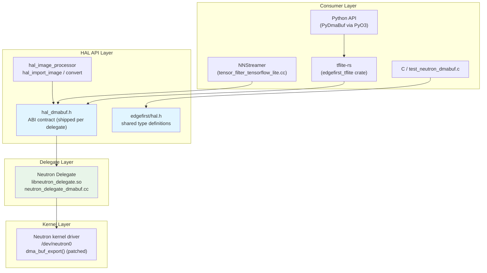
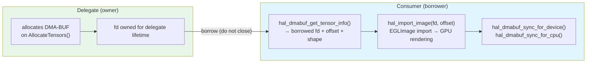
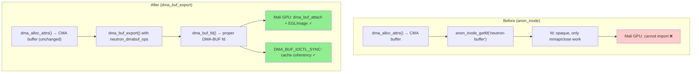
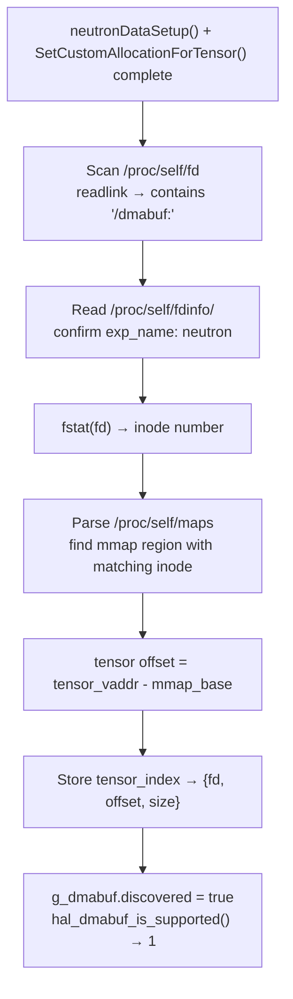
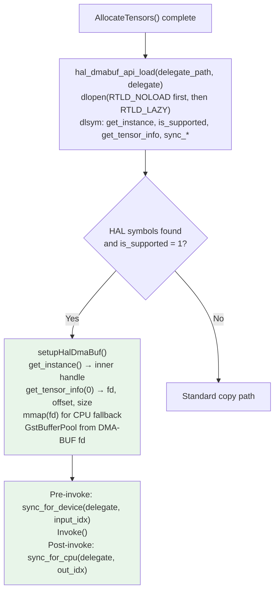
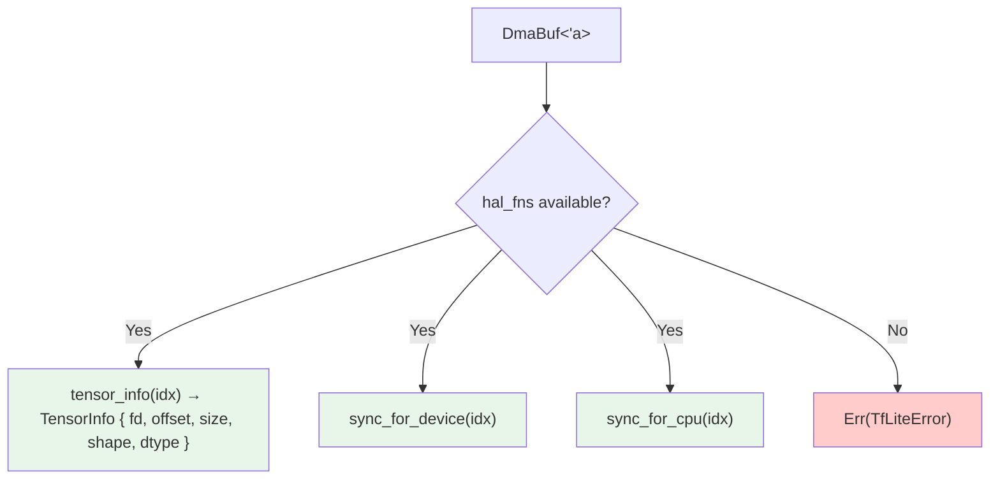
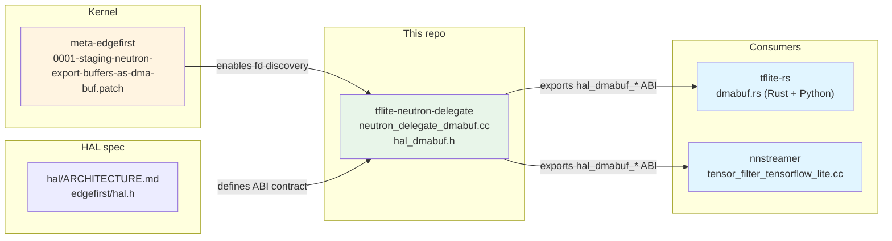

# DMA-BUF Zero-Copy Support for Neutron Delegate

## Document Information

| Field | Value |
|-------|-------|
| **Author** | Sébastien Taylor <sebastien@au-zone.com> |
| **Version** | 0.2.0 |
| **Date** | 2026-03-27 |
| **Status** | Test Release |

### Changelog

| Version | Date | Description |
|---------|------|-------------|
| 0.2.0 | 2026-03-27 | Updated to match working implementation; Mermaid diagrams; cross-references tflite-rs, nnstreamer, hal/ARCHITECTURE.md |
| 0.1.0 | 2026-03-24 | Initial architecture and requirements |

---

## Overview

This document describes the DMA-BUF zero-copy buffer sharing implementation for the TFLite Neutron Delegate on NXP i.MX 95. The feature enables GPU↔NPU zero-copy by allowing the GPU preprocessing pipeline (OpenGL fragment shaders on the ARM Mali Valhall GPU) to render directly into NPU input buffers, eliminating CPU memcpy from the inference pipeline.

The VX Delegate for NXP i.MX 8M Plus implements the same `hal_dmabuf_*` ABI and is documented separately: [`github.com/EdgeFirstAI/tflite-vx-delegate-imx`](https://github.com/EdgeFirstAI/tflite-vx-delegate-imx).

### Target Pipeline



---

## Architecture

### System Overview



### Buffer Ownership Model

The Neutron delegate uses a **delegate-owns-buffers** model: the delegate allocates the DMA-BUF memory and the consumer borrows the file descriptors. The consumer never allocates, registers, or releases buffers through the `hal_dmabuf_*` API.



---

## Kernel Driver Patch (Neutron)

### Background

The Linux DMA-BUF framework ([`Documentation/driver-api/dma-buf.rst`](https://www.kernel.org/doc/html/latest/driver-api/dma-buf.html)) defines a standard mechanism for sharing hardware DMA buffers between devices. A **DMA-BUF** is a `struct dma_buf` backed by a file descriptor created via `dma_buf_export()`. Any device driver can attach to that fd via `dma_buf_attach()` + `dma_buf_map_attachment()` and obtain its own IOMMU mapping to the same physical memory — with no CPU copies.

The Neutron kernel driver historically used `anon_inode_getfd()` for buffer file descriptors. Anonymous inodes are opaque kernel objects; the Mali GPU has no way to import them as DMA-BUFs. The patch converts the existing allocation to `dma_buf_export()`, making the fd a first-class DMA-BUF that:

- Mali imports via `EGL_EXT_image_dma_buf_import` (standard EGL extension)
- V4L2 and DRM consumers can import via standard `dma_buf_attach()`
- The kernel's `DMA_BUF_IOCTL_SYNC` ioctl works automatically for cache coherency
- `libNeutronDriver.so` is unaffected — it only calls `mmap()` and `close()` on the fd, both of which work identically with DMA-BUF fds

### Why the Existing Allocator Is Compatible

The Neutron driver allocates buffers with `dma_alloc_attrs(dev, size, DMA_ATTR_FORCE_CONTIGUOUS)`. This forces allocation from the system CMA pool (960 MB on imx95-evk). The CMA physical pages are contiguous, so they can be described by a single-entry `sg_table` — the core requirement for the `dma_buf_ops.map_dma_buf` implementation.

The Mali Valhall GPU manages its own MMU page tables independently of the SoC SMMU. It can map any CMA pages given a valid `sg_table` from `dma_buf_map_attachment()`. This is why GPU import works without changes to the Mali driver.

### What the Patch Changes



The `struct dma_buf_ops` implementation provides:

| Callback | Implementation |
|----------|---------------|
| `map_dma_buf` | Returns a single-entry `sg_table` from `dma_to_phys(buf->dma_addr)`. Calls `dma_map_sgtable()` on the **importing** device, creating its IOMMU mapping. |
| `unmap_dma_buf` | Calls `dma_unmap_sgtable()` and frees the `sg_table`. |
| `mmap` | Delegates to `dma_mmap_attrs()` — identical to the previous `neutron_buffer_fops.mmap`. |
| `release` | Calls `neutron_buffer_put()` — identical to the previous `neutron_buffer_fops.release`. |
| `begin_cpu_access` / `end_cpu_access` | Call `neutron_memory_sync()` for cache maintenance, consistent with `NEUTRON_IOCTL_CACHE_SYNC`. |

`neutron_buffer_get_from_fd()` is updated to use `dma_buf_get(fd)->priv` instead of `file->private_data`, with a safety check that validates `dmabuf->ops == &neutron_dmabuf_ops` before dereferencing `priv`.

### Delivery

The patch lives in the `meta-edgefirst` Yocto layer and is applied as a `.bbappend` on top of the NXP `linux-imx` kernel source:

**[`0001-staging-neutron-export-buffers-as-dma-buf.patch`](https://github.com/EdgeFirstAI/meta-edgefirst/blob/main/recipes-kernel/linux/files/0001-staging-neutron-export-buffers-as-dma-buf.patch)**

The NXP kernel source is not forked — the patch is layered on top, keeping the BSP maintainable.

### `libNeutronDriver.so` Compatibility

| Userspace operation | Before (anon_inode) | After (dma_buf) | Compatible? |
|---|---|---|---|
| `mmap(fd)` | `neutron_buffer_fops.mmap` → `dma_mmap_attrs()` | `dma_buf_ops.mmap` → same `dma_mmap_attrs()` | **Yes** |
| `close(fd)` | `neutron_buffer_fops.release` → `neutron_buffer_put()` | `dma_buf_ops.release` → same `neutron_buffer_put()` | **Yes** |
| `ioctl(fd, ...)` | No ioctl on buffer fd | `DMA_BUF_IOCTL_SYNC` added automatically by kernel | **Yes** (bonus) |

The proprietary library receives an fd, maps it, and uses the virtual pointer — this path is unchanged. All three `neutron_buffer_get_from_fd()` call sites (inference, cache sync, firmware load) are internal GPL code and are updated transparently.

---

## Delegate Implementations

### Neutron Delegate (i.MX 95)

#### fd Discovery

After `neutronDataSetup()` allocates buffers and `SetCustomAllocationForTensor()` registers them with TFLite, the delegate discovers the DMA-BUF fds by correlating `/proc/self/fd` with `/proc/self/maps`:



The correlation is possible because the Neutron NPU uses a single contiguous DMA buffer for all tensors (inputs, outputs, weights, microcode, scratch). All activation tensors are at offsets within one mmap region. The `exp_name: neutron` field in `fdinfo` is set by `exp_info.exp_name = "neutron"` in the kernel patch, making the identification unambiguous.

This approach is implemented in [`neutron_delegate_dmabuf.cc`](neutron_delegate_dmabuf.cc) and exposed via the `hal_dmabuf_*` symbols.

#### Environment Variable

DMA-BUF discovery is active when the existing zero-copy mode is enabled:

```sh
NEUTRON_ENABLE_ZERO_COPY=1 ./my_application
```

#### Single-Buffer Topology

| Property | Value |
|----------|-------|
| Buffer count | 1 per `NeutronGraph` partition |
| Tensor layout | All tensors at offsets within one buffer |
| Offset | Non-zero for most tensors (packed at compile-time offsets) |
| fd visibility | Confirmed: `libNeutronDriver.so` keeps fd open after `mmap()` |

---

## HAL DMA-BUF API

The `hal_dmabuf_*` API is a delegate-agnostic, stable ABI contract. Each delegate ships a self-contained `hal_dmabuf.h` header — consumers do not need the full `edgefirst/hal.h`. The shared type definitions (`hal_delegate_t`, `hal_dmabuf_tensor_info`, `hal_dtype`) are also defined in `edgefirst/hal.h` for consumers already using the full HAL.

See also: [EdgeFirst HAL ARCHITECTURE.md — Delegate DMA-BUF Framework](https://github.com/EdgeFirstAI/hal/blob/main/ARCHITECTURE.md)

### Type Definitions

```c
typedef void *hal_delegate_t;

typedef enum hal_dtype {
    HAL_DTYPE_U8  = 0,  HAL_DTYPE_I8  = 1,
    HAL_DTYPE_U16 = 2,  HAL_DTYPE_I16 = 3,
    HAL_DTYPE_U32 = 4,  HAL_DTYPE_I32 = 5,
    HAL_DTYPE_U64 = 6,  HAL_DTYPE_I64 = 7,
    HAL_DTYPE_F16 = 8,  HAL_DTYPE_F32 = 9,
    HAL_DTYPE_F64 = 10
} hal_dtype;

#define HAL_DMABUF_MAX_NDIM 8

typedef struct hal_dmabuf_tensor_info {
    size_t size;                        /* tensor region size in bytes */
    size_t offset;                      /* byte offset within the DMA-BUF */
    size_t shape[HAL_DMABUF_MAX_NDIM]; /* tensor dimensions */
    size_t ndim;                        /* number of valid shape entries */
    int    fd;                          /* borrowed DMA-BUF fd — do NOT close */
    hal_dtype dtype;                    /* element type */
} hal_dmabuf_tensor_info;

typedef struct hal_camera_adaptor_format_info {
    int  input_channels;
    int  output_channels;
    char fourcc[8];                     /* V4L2 FourCC string */
} hal_camera_adaptor_format_info;
```

> **`hal_delegate_t` vs. `TfLiteDelegate *`**: The `hal_delegate_t` is the *inner* delegate pointer, not the outer `TfLiteDelegate *` returned by `TfLiteExternalDelegateCreate()`. Always obtain it via `hal_dmabuf_get_instance()` — do not cast directly.

### Function Reference

| Function | Signature | Return | Notes |
|----------|-----------|--------|-------|
| `hal_dmabuf_get_instance` | `(void)` | `hal_delegate_t` | Inner delegate handle. NULL if no delegate created. |
| `hal_dmabuf_is_supported` | `(hal_delegate_t delegate)` | `int` 1/0 | Does NOT set errno. |
| `hal_dmabuf_get_tensor_info` | `(delegate, tensor_index, info*, info_size)` | `int` 0/-1 | `info_size = sizeof(*info)` for ABI safety. |
| `hal_dmabuf_sync_for_device` | `(delegate, tensor_index)` | `int` 0/-1 | Flush CPU caches before NPU reads. |
| `hal_dmabuf_sync_for_cpu` | `(delegate, tensor_index)` | `int` 0/-1 | Invalidate CPU caches after NPU writes. |
| `hal_camera_adaptor_is_supported` | `(delegate, format)` | `int` 1/0 | `delegate` unused (stateless query). |
| `hal_camera_adaptor_get_format_info` | `(delegate, format, info*, info_size)` | `int` 0/-1 | Fills channel counts and FourCC. |

All symbols must be exported with `__attribute__((visibility("default")))`.

### Error Handling

| errno | Meaning |
|-------|---------|
| `EINVAL` | NULL info, NULL delegate, negative tensor_index, or info_size too small |
| `ENOTSUP` | DMA-BUF not supported by this delegate or not yet initialized |
| `ERANGE` | tensor_index not found (out of range or not a DMA-BUF tensor) |
| `EIO` | DMA_BUF_IOCTL_SYNC ioctl failure or internal backend error |

`hal_dmabuf_is_supported()` and `hal_camera_adaptor_is_supported()` return 1/0 and do **not** set errno.

The `info_size` parameter provides forward ABI compatibility. Implementations must `memset(info, 0, info_size)` before populating, so callers using an older struct size receive zeroed fields for unknown extensions.

### Cache Synchronization

Both sync functions wrap `DMA_BUF_IOCTL_SYNC` on the tensor's fd:

| Function | ioctl flags | When to call |
|----------|-------------|-------------|
| `sync_for_device` | `DMA_BUF_SYNC_END \| DMA_BUF_SYNC_WRITE` | After CPU/GPU writes, before NPU reads. Call after `glFinish()`. |
| `sync_for_cpu` | `DMA_BUF_SYNC_START \| DMA_BUF_SYNC_READ` | After NPU writes, before CPU reads. Not needed for GPU-only downstream. |

> **Why `glFinish()` is not enough**: `glFinish()` guarantees GPU writes are complete in the GPU's own address space. On systems where the CPU mmap is cacheable (the default), stale CPU cache lines can shadow the GPU-written data from the NPU's perspective. `hal_dmabuf_sync_for_device()` flushes those cache lines.

### Camera Adaptor API

The Neutron delegate exports `hal_camera_adaptor_is_supported()` and `hal_camera_adaptor_get_format_info()` as required by the ABI contract, but both functions report no support: `is_supported` always returns `0` and `get_format_info` always returns `-1` with `errno = ENOTSUP`. The Neutron delegate has no mechanism to inject format conversion operations into the NPU graph.

Camera adaptor support (NPU-injected RGBA→RGB Slice and UINT8→INT8 DataConvert operations) is available in the VX Delegate for i.MX 8M Plus. See [`github.com/EdgeFirstAI/tflite-vx-delegate-imx`](https://github.com/EdgeFirstAI/tflite-vx-delegate-imx) and its [CAMERAADAPTOR.md](https://github.com/EdgeFirstAI/tflite-vx-delegate-imx/blob/main/CAMERAADAPTOR.md).

### Usage Example

```c
/* After interpreter setup and AllocateTensors() */
void *dlg_h = dlopen("libneutron_delegate.so", RTLD_LAZY);

hal_delegate_t (*get_inst)(void)   = dlsym(dlg_h, "hal_dmabuf_get_instance");
int (*is_sup)(hal_delegate_t)      = dlsym(dlg_h, "hal_dmabuf_is_supported");
int (*get_info)(hal_delegate_t, int, hal_dmabuf_tensor_info *, size_t)
                                    = dlsym(dlg_h, "hal_dmabuf_get_tensor_info");
int (*sync_dev)(hal_delegate_t, int) = dlsym(dlg_h, "hal_dmabuf_sync_for_device");

hal_delegate_t delegate = get_inst();
if (!is_sup(delegate)) { /* fall back to memcpy path */ }

/* Get input tensor DMA-BUF */
int input_idx = TfLiteInterpreterGetInputTensorCount(interp) > 0 ? 0 : -1;
hal_dmabuf_tensor_info info = {};
if (get_info(delegate, input_idx, &info, sizeof(info)) < 0) { /* fallback */ }

/* Import Neutron input buffer into HAL image pipeline */
struct hal_plane_descriptor *pd = hal_plane_descriptor_new(info.fd);
hal_plane_descriptor_set_offset(pd, info.offset);   /* non-zero for Neutron */
struct hal_tensor *npu_input = hal_import_image(proc, pd, NULL,
    model_w, model_h, HAL_PIXEL_FORMAT_RGB, HAL_DTYPE_I8);

/* Convert camera frame → NPU input (GPU zero-copy) */
hal_image_processor_convert(proc, camera_tensor, npu_input,
    HAL_ROTATION_NONE, HAL_FLIP_NONE, &crop);

/* Flush caches: GPU writes visible to NPU */
sync_dev(delegate, input_idx);

/* Run inference */
TfLiteInterpreterInvoke(interp);

/* Access output tensor for downstream processing */
hal_dmabuf_tensor_info out_info = {};
get_info(delegate, output_idx, &out_info, sizeof(out_info));
/* out_info.fd ready for display, encoder, or next model */
```

A complete end-to-end test is in [`hal/crates/capi/tests/test_neutron_dmabuf.c`](https://github.com/EdgeFirstAI/hal/blob/main/crates/capi/tests/test_neutron_dmabuf.c):

```sh
NEUTRON_ENABLE_ZERO_COPY=1 ./test_neutron_dmabuf /path/to/model.imx95.tflite
```

---

## Integration

### NNStreamer

Repository: [`github.com/EdgeFirstAI/nnstreamer`](https://github.com/EdgeFirstAI/nnstreamer) (fork of [nnsuite/nnstreamer](https://github.com/nnstreamer/nnstreamer))
Local: `../nnstreamer/ext/nnstreamer/tensor_filter/tensor_filter_tensorflow_lite.cc`

NNStreamer probes for the `hal_dmabuf_*` symbols at runtime via `dlopen`/`dlsym` after `AllocateTensors()` completes. The Neutron delegate is reached via the HAL path.



The HAL path is guarded by `#ifdef HAVE_EDGEFIRST_HAL`. The `HalDmaBufAPI` struct mirrors the function pointer table:

```c
typedef struct {
    void *(*get_instance)(void);
    int   (*is_supported)(void *);
    int   (*get_tensor_info)(void *, int, hal_dmabuf_tensor_info *, size_t);
    int   (*sync_for_device)(void *, int);
    int   (*sync_for_cpu)(void *, int);
    gboolean available;
} HalDmaBufAPI;
```

### tflite-rs

Repository: [`github.com/EdgeFirstAI/tflite-rs`](https://github.com/EdgeFirstAI/tflite-rs)
Local: `../tflite-rs/crates/tflite/src/dmabuf.rs`

The `edgefirst_tflite` Rust crate provides a safe `DmaBuf<'a>` wrapper. It probes for HAL symbols via `dlsym` at runtime.



`is_supported()`, `tensor_info()`, `sync_for_device()`, and `sync_for_cpu()` are the primary API surface.

### Python

The Python bindings are exposed via `PyDmaBuf` in `tflite-rs/crates/python/src/dmabuf.rs` and accessed through the `edgefirst_tflite` Python extension:

```python
import edgefirst_tflite as ef

interp = ef.Interpreter("model.imx95.tflite", delegate="libneutron_delegate.so")
interp.allocate_tensors()

dmabuf = interp.delegates[0].dmabuf()
if dmabuf.is_supported():
    info = dmabuf.tensor_info(0)
    # info = {"fd": 7, "offset": 131072, "size": 3145728, "shape": [1,640,640,3], "dtype": "i8"}

    # After GPU preprocessing:
    dmabuf.sync_for_device(0)
    interp.invoke()
    dmabuf.sync_for_cpu(1)
```

---

## Cross-Repository Dependency Map



The VX Delegate for i.MX 8M Plus implements the same ABI and connects to the same consumers. See [`github.com/EdgeFirstAI/tflite-vx-delegate-imx`](https://github.com/EdgeFirstAI/tflite-vx-delegate-imx).

---

## References

| Resource | Location |
|----------|----------|
| Neutron delegate implementation | `neutron_delegate_dmabuf.cc`, `hal_dmabuf.h` (this repo) |
| VX delegate (i.MX 8M Plus) | [`github.com/EdgeFirstAI/tflite-vx-delegate-imx`](https://github.com/EdgeFirstAI/tflite-vx-delegate-imx) — `DMABUF.md` |
| Kernel patch | [`meta-edgefirst — 0001-staging-neutron-export-buffers-as-dma-buf.patch`](https://github.com/EdgeFirstAI/meta-edgefirst/blob/main/recipes-kernel/linux/files/0001-staging-neutron-export-buffers-as-dma-buf.patch) |
| HAL ABI specification | [`hal/ARCHITECTURE.md`](https://github.com/EdgeFirstAI/hal/blob/main/ARCHITECTURE.md) — Delegate DMA-BUF Framework section |
| EdgeFirst HAL C header | `edgefirst/hal.h` (`hal/crates/capi/include/edgefirst/hal.h`) |
| tflite-rs consumer | [`github.com/EdgeFirstAI/tflite-rs`](https://github.com/EdgeFirstAI/tflite-rs) — `crates/tflite/src/dmabuf.rs` |
| NNStreamer fork | [`github.com/EdgeFirstAI/nnstreamer`](https://github.com/EdgeFirstAI/nnstreamer) — `tensor_filter_tensorflow_lite.cc` |
| End-to-end C test | `hal/crates/capi/tests/test_neutron_dmabuf.c` |
| Linux DMA-BUF documentation | [`Documentation/driver-api/dma-buf.rst`](https://www.kernel.org/doc/html/latest/driver-api/dma-buf.html) |
| EGL dmabuf import extension | `EGL_EXT_image_dma_buf_import` specification |
